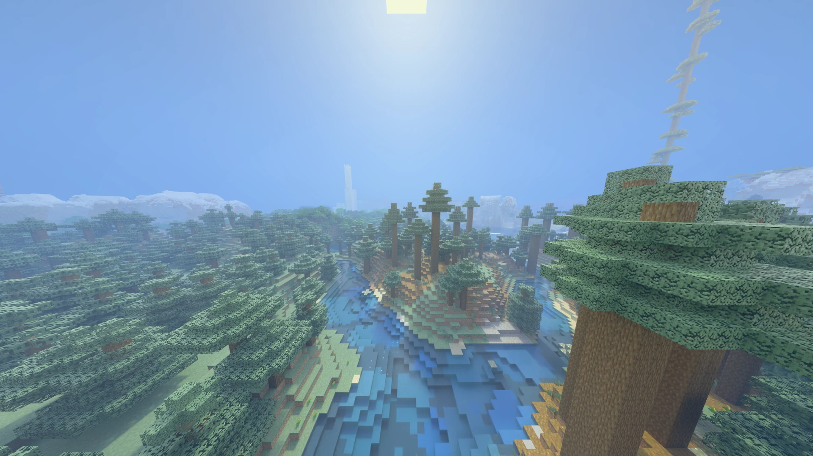
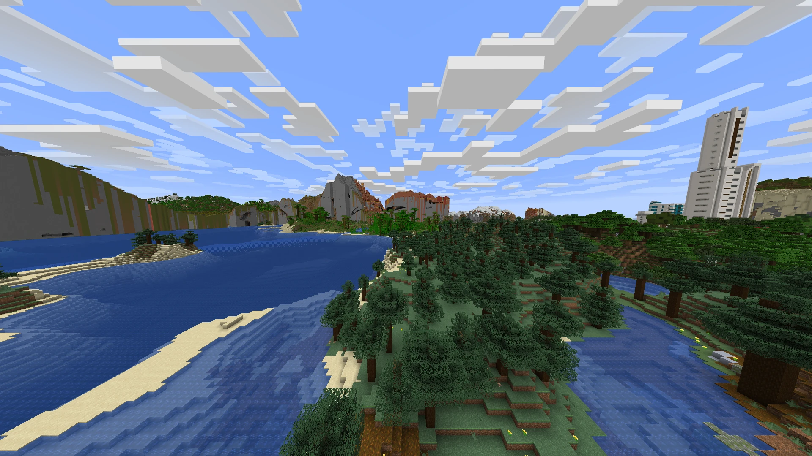
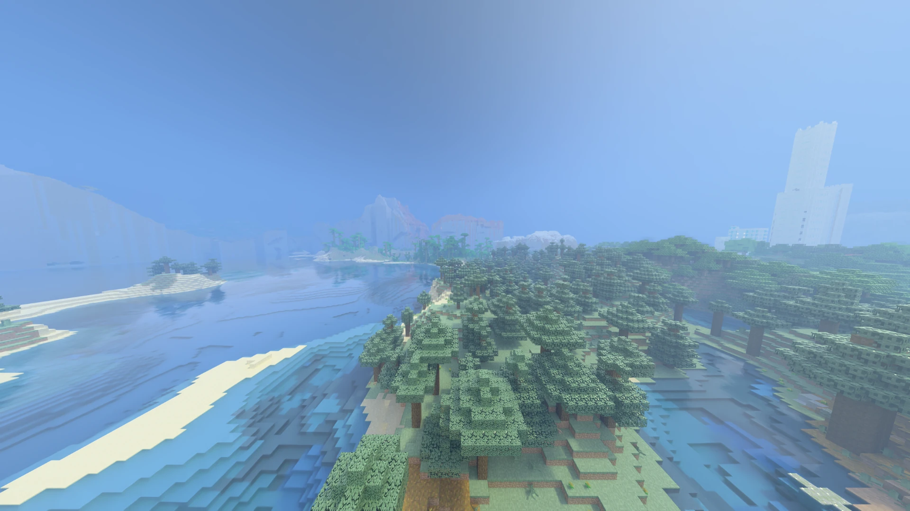

# Radiante

Path-traced rendering for Minecraft 26.3 (Fabric, NeoForge and Forge), built on Minecraft's own Vulkan backend.

[GitHub](https://github.com/Gabrieli2806/Radiante-26.3-Fabric) · [Modrinth](https://modrinth.com/project/radiante) · [CurseForge](https://www.curseforge.com/minecraft/mc-mods/radiante) · [Discord](https://discord.gg/DhBbAzugZ9) · [Full documentation](docs/en/README.md)

Languages: **EN** · [ES](README.es.md)



Radiante is a fork of [Radiance](https://github.com/Minecraft-Radiance/Radiance) and its native renderer
[MCVR](https://github.com/Minecraft-Radiance/MCVR), rewritten for the render pearl (`com.mojang.renderpearl`)
Vulkan backend introduced in Minecraft 26.3. Instead of creating its own Vulkan device next to the game, it
shares the device Minecraft already created, so the ray tracer and the vanilla GUI draw into the same frame.

**Ray tracing off and on.** The same view with vanilla lighting and with Radiante.

| Off (vanilla) | On (DLSS Quality) |
|---|---|
|  |  |

## Features

- Hardware ray tracing (`VK_KHR_ray_tracing_pipeline`) for terrain, with path-traced direct lighting,
  shadows and global illumination, on Windows and Linux.
- Physically based sky, sun and atmospheric scattering.
- One built-in shader pack, `vanilla-pt`, with direct sampling of block lights (torches, lava, lamps) and ReSTIR
  reuse of them, froxel or ray-marched volumetric fog, volumetric clouds with optional shadows, rain refraction and
  wet ground, seamless glass, and pixelated lighting for entities and blocks.
- LabPBR support (`_s`/`_n` maps) for blocks, atlases and entities/held items, with per-entity emission
  (glow item frames, end crystals, self-lit mobs, glowing dropped items). A custom resource pack with PBR maps (or a
  Bedrock `.mcpack`) is recommended to get the most out of these features.
- FSR upscaling and frame generation built in; NVIDIA DLSS (upscaling, Ray Reconstruction, frame generation up to
  4x on RTX 50) and Intel XeSS downloaded in game on request. NRD denoising for the non-DLSS pipelines.
- NVIDIA Reflex through `VK_NV_low_latency2`, no restart needed.
- Motion blur and depth of field, both toggleable. HDR output on HDR displays.
- Bedrock `.mcpack` resource pack support (including fog and water), detected directly in the pack list.
- [Distant Horizons](https://modrinth.com/mod/distanthorizons) support: its far terrain is path traced along with
  the rest of the world, one colour per block face, hidden column by column where near terrain is already built
  (optional; nothing changes without it). Frame cost grows with DH's render distance.
- Runs on the device Minecraft creates: no second Vulkan instance, no duplicated swapchain.
- One ~15 MB jar per loader carries both renderers; they are unpacked into the game folder on first start.

## Requirements

- Windows x64, or Linux x86-64 with glibc 2.35+ (Ubuntu 22.04, Debian 12, Fedora 36 or newer).
- A GPU with Vulkan ray tracing support (`VK_KHR_ray_tracing_pipeline` and
  `VK_KHR_acceleration_structure`).
- Minecraft 26.3 with one of:
  - Fabric Loader 0.19.5+ and Fabric API 0.160.5+26.3,
  - NeoForge 26.3.0.10-beta+,
  - Forge 26.3-66.0.3+.
- FSR (upscaling and frame generation) is built in. NVIDIA DLSS (~115 MB) and Intel XeSS (~73 MB, Windows only)
  are downloaded in game on request, from NVIDIA's and Intel's own repositories, and used from the next start;
  the first menu offers DLSS on NVIDIA GPUs and XeSS on Intel ones, and Radiante settings can download or delete
  either.
- NVIDIA Reflex needs an NVIDIA GPU and driver with `VK_NV_low_latency2` (Windows and Linux); the option is hidden
  elsewhere.
- Java 25.

Debug logging is on by default: Radiante's diagnostics and the native renderer's own messages (prefixed
`[native]`, errors always) go to `latest.log`, so that one file is enough when reporting a problem. It can be turned
off in Radiante settings, under Other.

Full player documentation (every setting, upscalers, Linux, troubleshooting): [docs/en](docs/en/README.md).

### Linux notes

- The game must run on the real GPU driver. If the log shows `Using graphics device: llvmpipe`, Vulkan fell back
  to Mesa's software renderer: the world renders black and DLSS is not offered.
- **Flatpak launchers** (Modrinth, Prism, etc.) need the Flatpak GL runtime that matches the host NVIDIA driver
  exactly. Check the driver with `cat /sys/module/nvidia/version` (e.g. `595.91.07`) and install
  `flatpak install flathub org.freedesktop.Platform.GL.nvidia-595-91-07` (dots become dashes). Repeat after every
  driver update. Non-Flatpak launchers use the host driver directly and need nothing extra.
- Under Wayland with NVIDIA, Minecraft's OpenGL backend usually fails (`EGL_BAD_DISPLAY`); Radiante always keeps
  Vulkan available as a fallback.

#### Black or glitched world on Linux

Check `logs/launcher_log.txt` (or `latest.log`) of the instance you actually launch, in this order:

1. **`Using graphics device: llvmpipe`** - not on the GPU driver, see the Flatpak note above.
2. **`version 'GLIBC_2.xx' not found`** - the system glibc is older than the one `libcore.so` was built against.
   Release builds need glibc 2.35+; a `libcore.so` built on a newer distribution must keep the symbol pinning in
   `native/glibc_compat.h` and `native/src/core/glibc_shims.cpp` (check with
   `objdump -T libcore.so | grep -o 'GLIBC_2\.[0-9]*' | sort -Vu | tail -1`).
3. **`UnsatisfiedLinkError: ... RendererProxy.<method>`** - the Java side is newer than the native library. Any change
   under `native/` (made on Windows too) needs `native/build-linux.sh` again before packaging.
4. **`FSR3: CreateContext failed`** or **`Failed to load shared shader pack`** - a FidelityFX or minizip build problem;
   the native library has to be rebuilt from this repository, which carries the Linux fixes below.
5. The launcher may run a different instance than the one you copied the jar into (Flatpak and non-Flatpak Modrinth
   keep separate folders: `~/.var/app/com.modrinth.ModrinthApp/data/ModrinthApp/profiles` and
   `~/.local/share/ModrinthApp/profiles`). The log's `gameDir` shows which one is running.

Linux-specific fixes in the bundled third-party code, which must be kept when updating it:

- **minizip-ng** is built with zlib-ng fetched and linked statically (`native/CMakeLists.txt`). Without zlib it
  silently loses deflate support, the built-in shader pack zip cannot be extracted, and the world is black.
- **FidelityFX SDK**: `wchar_t` is 4 bytes on Linux (2 on Windows). `FFX_RESOURCE_NAME_SIZE` stays 64 on every
  platform; the opaque context sizes (`FFX_SDK_DEFAULT_CONTEXT_SIZE`, `FFX_DENOISER_CONTEXT_SIZE`) are doubled off
  Windows, and the `static_assert`s checking that the private contexts fit are enabled everywhere. Shortening names
  instead (an earlier attempt) truncated shader binding names: FSR frame generation output black/garbage frames and
  the FSR upscaler failed to create, which made the `RT-NRD-FSR` preset render black. Names are formatted with
  `%ls`, never `%s`, in wide `swprintf` calls.
- `libcore.so` exports only the JNI entry points (`native/src/core/exports.map`) and keeps its static libstdc++
  private; otherwise it clashes with the system libstdc++ already loaded in the game and crashes at startup.

## Building

The mod bundles a native library (`core.dll` on Windows, `libcore.so` on Linux) built from `native/`. Both link
against NVIDIA's NGX libraries from the DLSS SDK, which is not in this repository; the DLSS runtimes themselves are
never shipped (players download them in game). Get the SDK libraries once, at the version the build expects:

```sh
git clone --depth 1 --branch v310.9.1 https://github.com/NVIDIA/DLSS.git /tmp/dlss
mkdir -p native/extern/DLSS/lib
cp -r /tmp/dlss/lib/Windows_x86_64 native/extern/DLSS/lib/   # or Linux_x86_64 on Linux
```

```sh
# 1. native renderer (Visual Studio 2026 toolchain, x64, Vulkan SDK 1.4.341+)
cmake -S native -B build/native -G "Visual Studio 18 2026" -A x64 -DMCVR_ENABLE_NRD=ON -DUSE_AMD=ON
cmake --build build/native --config Release --target INSTALL -j 16

# 2. the mod, one jar per loader in fabric/, neoforge/ and forge/ build/libs
./gradlew.bat build
```

The CMake install step copies the shaders and modules into `common/src/main/resources/radiante-native/`; the
built `core.dll` goes into the same folder. `./gradlew.bat :fabric:runClient`, `:neoforge:runClient` or
`:forge:runClient` launches a development client; all three share the `run/` folder.

#### Which build a change needs

Gradle does **not** rebuild the native part. Shaders are packed into
`radiante-native/shaders/world/ray_tracing/vanilla-pt.zip` (and the other shader folders) only by the CMake
install step, so a change under `native/` that is followed by Gradle alone builds a jar with the **old** shaders,
and the change never shows in game.

| What changed | Run |
| --- | --- |
| Java only (`common/`, `fabric/`, `neoforge/`, `forge/`) | Gradle |
| Shaders (`native/src/shader/**`: `.glsl`, `.rgen`, `.rchit`, `.rahit`, `.comp`, `configs.json`, `lang/`) | native build (step 1, or `nativeuild-windows.bat`), then Gradle |
| Native C++ (`native/src/core/**`, `native/include/**`) | native build, then Gradle |

To check a shader change made it in, the timestamp of
`common/src/main/resources/radiante-native/shaders/world/ray_tracing/vanilla-pt.zip` must be newer than the edit.
Restart the game after installing the new jar: shaders are loaded once at start.

On Linux the native renderer is `libcore.so`, installed into `radiante-native/linux-x64/`:

```sh
# needs cmake, ninja, g++ 13+, git and the Vulkan SDK (VULKAN_SDK set, glslangValidator on PATH)
native/build-linux.sh            # add -DVulkan_LIBRARY=/usr/lib/x86_64-linux-gnu/libvulkan.so.1 if CMake cannot find it
./gradlew :fabric:build
```

A jar built on Linux only contains the Linux renderer (and one built on Windows only `core.dll`); for a release
that runs on both, build the native part on both systems before packaging. The GitHub Actions workflow
(`.github/workflows/build.yml`) does this: it builds `core.dll` on Windows and `libcore.so` on Linux, packages one
jar per loader with both, and fails if either is missing. Check a jar with
`unzip -l <jar> | grep -E 'core.dll|libcore.so'`.

### Releases

Releases are cut by the GitHub Actions workflow, not by hand:

1. Add a `## [x.y.z] - date` section to `changelog.md`.
2. Bump `mod_version` in `gradle.properties` and push to `main` (or `multiloader`).
3. The workflow sees a version with no `v<mod_version>+<minecraft_version>` tag yet, builds both renderers and the
   three jars, and publishes a GitHub release with that tag. Its notes are the changelog section for the version.
4. If the repository has them configured, the same run uploads each loader's jar to Modrinth and CurseForge as a
   beta: secrets `MODRINTH_TOKEN` / `CURSEFORGE_TOKEN`, variables `MODRINTH_ID` / `CURSEFORGE_ID`. A site whose token
   or ID is missing is skipped.

Pushes that only touch Markdown or `docs/` do not start a build. Pull requests build but never publish.

### Project layout

- `common/` - everything that is plain Minecraft: the renderer, mixins, settings, assets, native files. It is
  compiled against vanilla Minecraft only, so loader-specific code cannot creep in.
- `fabric/`, `neoforge/`, `forge/` - each compiles the common sources together with its own small glue: the
  entrypoint (key bindings, client tick, settings screen) and a `RadiantePlatform` implementation (game
  directory, Fabric's mesh submissions), registered under `META-INF/services`.
- `native/` - the C++ Vulkan renderer (ray tracing pipelines, shaders under `native/src/shader/`, upscaler,
  frame generation and denoiser integration) built with CMake, and installed into `common/`'s resources. Packaging
  xz-compresses the libraries and records their SHA-256, which is checked when they are unpacked at start.
- `.github/workflows/build.yml` - CI and releases (see [Releases](#releases)).
- Versions for all of them live in the root `gradle.properties`.

Useful run flags (Fabric):

- `-PquickPlay="<world name>"` — boot straight into a world.
- `-PvulkanValidation` — enable Vulkan validation layers and render debug labels.

## How it works

- `VulkanInstance` / `VulkanDevice` creation is redirected into the native `createMerged` entry points, which
  add the ray tracing, descriptor indexing and upscaler extensions to whatever Minecraft asked for and merge
  the feature chains.
- Access to the graphics queue is serialised between Minecraft and the renderer through hooks installed over
  volk's function pointers.
- Each frame the renderer records its upload / world / composite command buffers and hands them to
  Minecraft's `VulkanCommandEncoder.execute`, then waits on Minecraft's timeline semaphore.
- Terrain is compiled into the renderer's own PBR vertex format from `ModelBlockRenderer` / `FluidRenderer`,
  mirroring Minecraft's section storage.
- Atlases are stitched on the GPU in 26.3, so the sampled copy is rebuilt from the sprite images, honouring
  the stitcher's per-sprite padding.

## Contributing

Bug reports, shader tweaks and pull requests are welcome.

### Getting set up

1. Fork the repo and clone your fork.
2. Follow [Building](#building) above to get a native build and a dev client running.
3. VS Code users: `.vscode/` ships tasks for each loader's client (build and debug), plus attach configs on
   port 5005. `File > Open Workspace` on the repo root picks these up automatically.

### Making changes

- Branch off `main`; give the branch a short, descriptive name (`fix/rain-motion-vectors`,
  `feat/end-crystal-tint`).
- Keep `common/` loader-agnostic. If a change needs loader-specific behaviour, add it behind
  `RadiantePlatform` and implement it in `fabric/`, `neoforge/` and `forge/`, not with `instanceof` checks
  against a loader's classes in `common/`.
- Shader changes live under `native/src/shader/`; native renderer/C++ changes under `native/src/core/` and
  `native/src/common/`. Match the surrounding code's comment density and naming — comments here explain *why*
  a value or check exists, not what the line does.
- Mod compatibility fixes should be general, not tied to one mod. If mod X breaks because Radiante skips or
  replaces something vanilla does (e.g. `LevelRenderer.render`, whose head hooks still run through
  `LevelRendererSkipMixin`), restore that vanilla behaviour so every mod relying on it benefits, instead of
  special-casing X by name. Only fall back to a mod-specific patch when no general fix exists, and keep it
  optional (reflection, no hard dependency).
- Test in a `Radiante*`-prefixed world under `run/saves/` (a fresh superflat is usually enough) — never point
  a dev/test run at a world you actually play in. `-PquickPlay="<world>"` boots straight into one.
- Before opening a PR: rebuild natives (`cmake --build ... --target INSTALL`), run `./gradlew.bat build` for
  all three loaders, and sanity-check the change in game (screenshot it if it's visual).
- No AI attribution (co-author lines, "Generated with ..." trailers, etc.) in commit messages or PR
  descriptions — write them as your own.

### Pull requests

- One logical change per PR; keep unrelated formatting/reflow out of the diff.
- Describe what changed and why, and how you tested it (screenshots for visual changes are especially
  helpful).
- Reference the relevant [ROADMAP.md](ROADMAP.md) item if the PR closes or advances one.
- Large or architectural changes (new render passes, new upscaler backends, loader-parity work) are easier to
  land if discussed in an issue or on [Discord](https://discord.gg/DhBbAzugZ9) first.

## Licence

GPL-3.0, inherited from the upstream projects. Radiance and MCVR are by LJIONG and Interstellarss; this fork
keeps their licence and credits.
