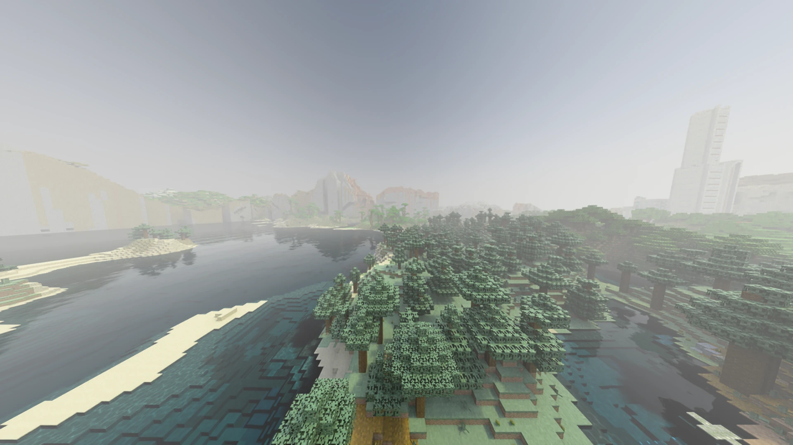
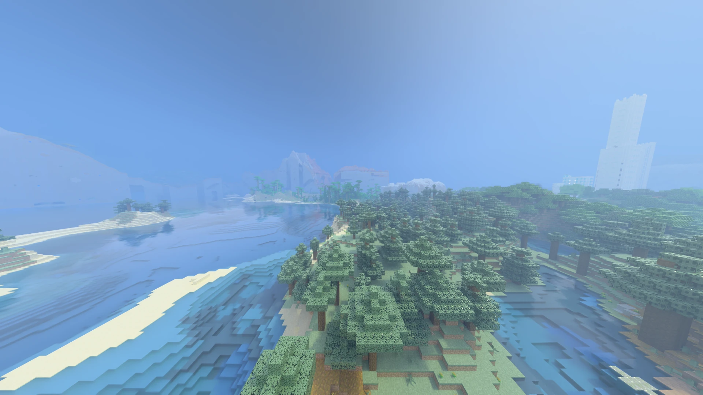

[← Back to index](README.md)

# Performance guide

> This page is general advice for gaining FPS. If you are after exactly what each control in the
> "Performance" settings category does, that is a different page:
> **[settings/performance.md](settings/performance.md)**.

## Start with the Quality selector

Before touching individual controls, try the levels on the **Quality** selector in
[Quality & Upscaling](settings/quality-and-upscaling.md) — Low, Medium, High, Ultra. Each sets, all
at once, the controls measured to cost the most (DLSS mode, block light sampling, volumetric fog,
clouds, render distance, light bounces and more), in combinations that have already been tested. The
exact detail of what each level sets is in
[styles-and-quality.md#quality-levels](styles-and-quality.md#quality-levels).

**Low and Ultra quality.** Low turns volumetric fog off and renders fewer chunks at a lower DLSS mode.

| Low | Ultra |
|---|---|
|  |  |

## The controls that cost the most, by impact

Measured on a reference scene, with DLSS Mode Ultra Performance (~150 fps) or Balanced (~80 fps) as
the baseline:

1. **DLSS Mode** (or **Upscaling Mode** with FSR/XeSS) — the biggest change of all.
   Starting from Ultra Performance as the baseline, switching to Performance costs about -45% fps,
   and switching to Quality, about -65%. It is the first thing to touch if you need more FPS right
   now.
2. **Light Bounces** (Performance category, 1 – 8) — 4 to 2 is about +55% fps, with little visible
   change. Above 4 is for strong GPUs. To lower it only far away, use **Far Bounce Distance**: just
   the distant terrain gets fewer bounces. **Cache Deep Bounces** (on by default) saves a lot where
   there are many lights.
3. **Render distance** — 24 chunks costs about 30% more than 16.
4. **Volumetric Fog** — about 10% when turned off; its "Quality" (samples per ray) also matters: 32
   samples costs about 30% more than 16.
5. **Block Light Sampling** — about 20% when off, but much more noise at night and in caves; usually
   not worth it. **ReSTIR** cuts noise with many lights without that cost. **SER** (RTX 40+) may
   gain some speed but is experimental.
6. **Carved Surfaces** (parallax) and **Clouds** — a few percentage points each; only worth touching
   once you are already tuning everything else.

Held item light and First Person Shadow changed nothing measurable in these tests — no need to touch
them for performance.

## If you are tight on VRAM

- Lower **Chunk Batches** (Performance category) — fewer acceleration structure builds in flight on
  the GPU at once use less video memory, at the cost of loading terrain somewhat slower.
- Lower the render distance.
- If you use Distant Horizons, remember its own render distance also uses VRAM on top of the game's
  own — see [distant-horizons.md](distant-horizons.md).

## If the game stutters loading new terrain (flying, teleporting)

- Raise **Chunk Threads** if your CPU has headroom — but not past half your logical cores; more than
  that takes time away from the render thread instead of helping. See the full explanation in
  [settings/performance.md](settings/performance.md#why-the-chunk-threads-maximum-is-half-your-cores).
- Lower **Chunk Batch Size** if the stutter happens right when chunks are being built, not while they
  load — a smaller batch spreads the work into shorter, more frequent builds instead of one large one
  that blocks a whole frame.

## Frame Generation as an alternative

If you already get 60+ real FPS on a 144 Hz or faster monitor,
[frame generation](frame-generation-reflex.md) adds smoothness without touching quality, at the
cost of some latency that Reflex helps offset. FSR works on any GPU (2x); DLSS on NVIDIA (up to 4x
on RTX 50).

## A known reference point

The goal of a mid-range GPU (say, an RTX 3060 or RX 6700) holding 60 fps at 12 chunks with DLSS or
FSR is still being built into a documented preset — see
[ROADMAP.md](../../ROADMAP.md). If you have a GPU in that range and want to share
your own numbers, the [Discord](https://discord.gg/DhBbAzugZ9) is the place.
