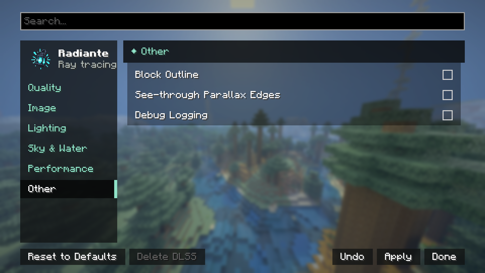

[← Settings](../settings.md) · [Index](../README.md)

# Other

| Control | Values | Default | What it does |
|---|---|---|---|
| **Block Outline** | On/Off | Off | The outline around the block under the crosshair. |
| **See-through Parallax Edges** | On/Off | Off | With resource packs that carve their textures (parallax), the carved part at the outer edges of a block becomes see-through, as if it were really cut away. Off, those edges show the border's colour instead of transparency. |
| **Debug Logging** | On / Off | On | Writes Radiante's and the native renderer's detail to `latest.log` (`[native] ...` lines). On by default so one log is enough to report a problem. Renderer errors reach the log even with it off. |

None of these three affects performance in any measurable way; they are comfort or debugging
settings, not visual quality or speed ones.
