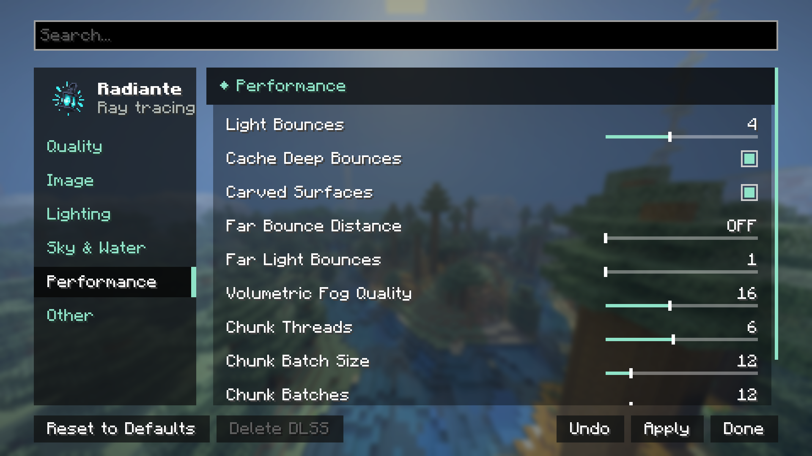

[← Settings](../settings.md) · [Index](../README.md)

# Performance (settings category)

> This page is the reference for the controls that live in the "Performance" category of the
> settings screen. If you are after general tips for gaining FPS (which preset to pick, how your
> GPU compares, Distant Horizons' cost), that is a different page:
> **[performance.md](../performance.md)**, at the root of the documentation.

| Control | Range | Default | What it does |
|---|---|---|---|
| **Light Bounces** | 1 – 128 | 4 | How many times light bounces. 4 to 2 is about +50% FPS. Above 4 costs a lot and is for strong GPUs; mirrors and clear glass get extra bounces on their own. |
| **Cache Deep Bounces** | On / Off | On | After the first bounce, light comes from the radiance cache instead of more tracing, and bounced surfaces skip block light lookups, as in Bedrock RTX. Much faster with many lights; bounced light may look slightly softer. |
| **Far Bounce Distance** | Off, 1 – 32 chunks | Off | Beyond this distance, surfaces only get the Far Light Bounces. For example 8 with render distance 16: the far half costs less. |
| **Far Light Bounces** | 1 – 4 | 1 | Bounces for surfaces beyond the Far Bounce Distance. Hardly visible far away. |
| **Carved Surfaces** (parallax) | On/Off | On | Depth on resource pack textures that have height maps — bricks and stones stand out. Off: flat textures and somewhat faster. Without a pack that has height maps, this control changes nothing visually. |
| **Volumetric Fog Quality** | 4 – 32 samples | 16 | Samples per ray for the volumetric fog (see [Sky, Fog & Water](sky-fog-water.md)). Lower is faster and a little noisier; 32 costs about 30% more than 16. Only shows up if your pipeline supports volumetric fog. |
| **Chunk Threads** | 1 – half your logical cores (max) | Half your logical cores | CPU threads that turn loaded chunks into ray tracing geometry. More loads new areas faster when you fly or teleport, but competes with the game (and, in singleplayer, with the integrated server generating those same chunks) for CPU. Lower it if the game stutters while loading terrain; raise it if chunks visibly take a while to pop in. |
| **Chunk Batch Size** | 1 – 64 | 12 | How many chunk sections are sent to the GPU in one acceleration structure build. Higher fills the world in faster but can cause frame time spikes while loading; lower is smoother but slower to catch up. |
| **Chunk Batches** | 1 – 64 | 12 | How many of those builds may be in flight on the GPU at once. Higher loads faster on strong GPUs and uses more video memory; lower it if you see hitches or run out of VRAM. |
| **Block Emission** | On/Off | On | Blocks that give off light (torches, lava, glowstone...) light up the world around them. Off saves some performance, but light sources then only glow themselves — needed for "Block Light Sampling" (in [Lighting](lighting.md)) to have anything to sample. |

## Why the Chunk Threads maximum is half your cores

It is not an arbitrary number: on a 24-thread CPU, measuring with 20 building threads dropped the
frame rate from 120 to about 65 for several seconds after every teleport, while 4 threads held the
game above 110 FPS and loaded the area just as fast. More threads than your CPU can spare without
taking them from rendering just makes the game run worse, not load sooner.
