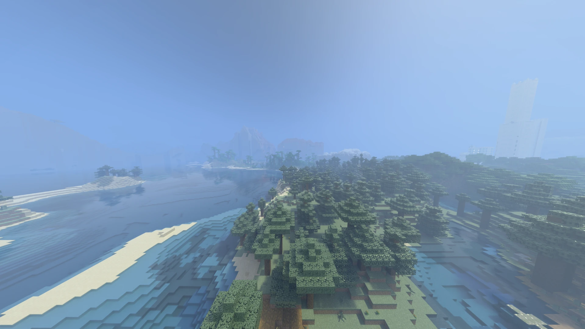
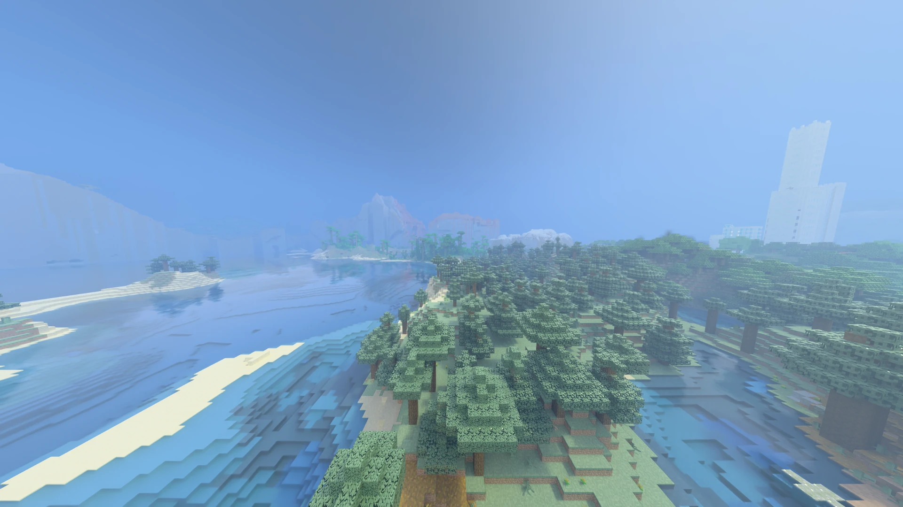
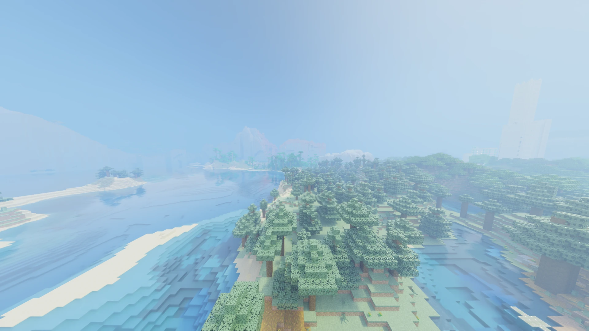

[← Back to index](README.md)

# Picture styles and quality levels

Radiante has two "bundle" selectors that set several individual controls at once. They are
independent of each other: **Quality** affects what costs performance, **Picture Style** affects how
colour and light look. Touching any control either one covers, by hand, switches that selector to
"Custom" — there is no "halfway" state for either.

## Quality levels

The **Quality** selector, at the top of [Quality & Upscaling](settings/quality-and-upscaling.md),
sets, all at once, the controls measured to cost the most frames per second:

| Level | DLSS / Upscaling Mode | Volumetric Fog | Clouds | Block Light Sampling | Render Distance | Light Bounces | Carved Surfaces | Volumetric Fog Quality |
|---|---|---|---|---|---|---|---|---|
| **Low** | Ultra Performance | Off | Off | On | 8 chunks | 2 | Off | 8 samples |
| **Medium** | Performance | Off | Vanilla | On | 12 chunks | 2 | Off | 8 samples |
| **High** | Balanced | On | Vanilla | On | 16 chunks | 3 | On | 16 samples |
| **Ultra** | Quality | On | Volumetric | On | 24 chunks | 4 | On | 24 samples |

The mode applies to whichever upscaler you use: DLSS Mode with RT-DLSS, Upscaling Mode with FSR or
XeSS. Low uses 2 bounces, not 1: with one, rooms lose the light bouncing off walls and ceiling and
look flat.

These numbers came from measuring one scene with the same chunks loaded, using DLSS Mode Ultra
Performance (~150 fps) or Balanced (~80 fps) as the baseline for the shader pack settings:

- DLSS mode: starting from Ultra Performance as the baseline, switching to Performance costs about
  -45% fps, and switching to Quality, about -65%.
- Light bounces: 4 to 2 is about +55% fps; 4 to 1 is +130% — with little visible change either
  outdoors or indoors.
- Block Light Sampling: -20% when off (but much more noise at night and in caves).
- Volumetric fog: -10% when off; 32 samples costs about 30% more than 16.
- Render distance: 24 chunks costs about 30% more than 16.
- Carved surfaces (parallax) and clouds: a few percentage points each.

Held item light and First Person Shadow are not in the table because they changed nothing
measurable in those tests — they are left out of the Quality selector on purpose.

On a fresh install the selector may show **Custom**: the defaults do not match any level exactly.
Not a bug; pick a level once.

## Picture styles

The **Picture Style** selector, in [Image](settings/image.md), sets Saturation, Bounced Light and
Sky Light (and the tone mapping method) all at once:

| Style | Tone Mapping | Saturation | Bounced Light | Sky Light |
|---|---|---|---|---|
| **Natural** | PBR Neutral | 100% | 100% | 100% |
| **Bedrock** | PBR Neutral | 120% | 150% | 180% |
| **Vivid** | ACES | 130% | 150% | 150% |

- **Natural** — physically correct light and colour, with nothing tuned on top. It is the neutral
  baseline.
- **Bedrock** — tuned to match Bedrock RTX's look: more saturated, with brighter shade and bounced
  light than physically correct, so rooms feel more lit from a single light source.
- **Vivid** — more contrast (via the more filmic ACES tone mapping) and more colour than Natural,
  without Bedrock's extra bounced light.

**Picture styles.** Natural, Bedrock and Vivid change saturation, tone mapping and how far bounced light carries.

*Natural*

*Bedrock*

*Vivid*

## How it relates to "Atmosphere"

Picture Style does not change the **Atmosphere** setting (Java/Bedrock, in
[Sky, Fog & Water](settings/sky-fog-water.md)) — they are independent. Atmosphere decides where the
sky and sunlight colours come from; Picture Style decides how the final colour is processed on
screen. They combine freely: for example, a Java sky with the Bedrock style, or a Bedrock sky with
the Natural style.

## Quick quality comparison

**Low and Ultra quality.** Low turns volumetric fog off and renders fewer chunks at a lower DLSS mode.

| Low | Ultra |
|---|---|
|  |  |
