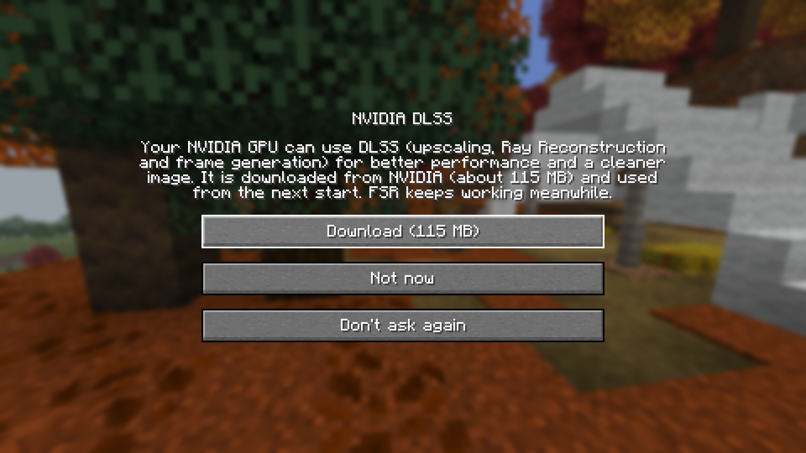
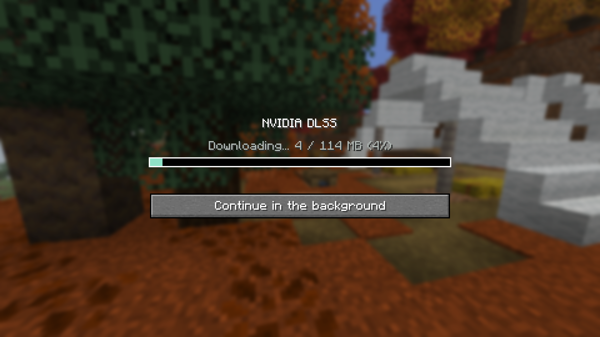
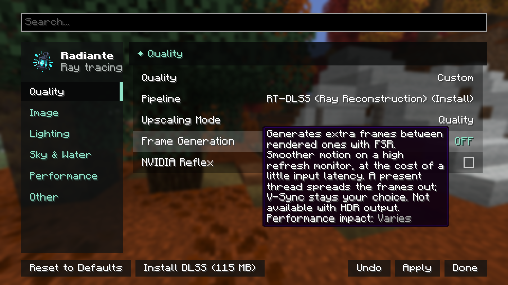
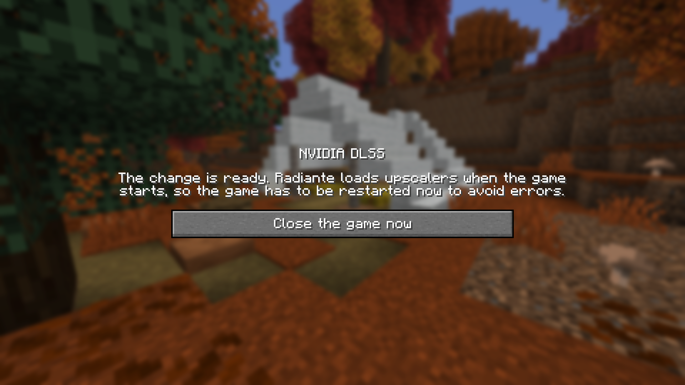
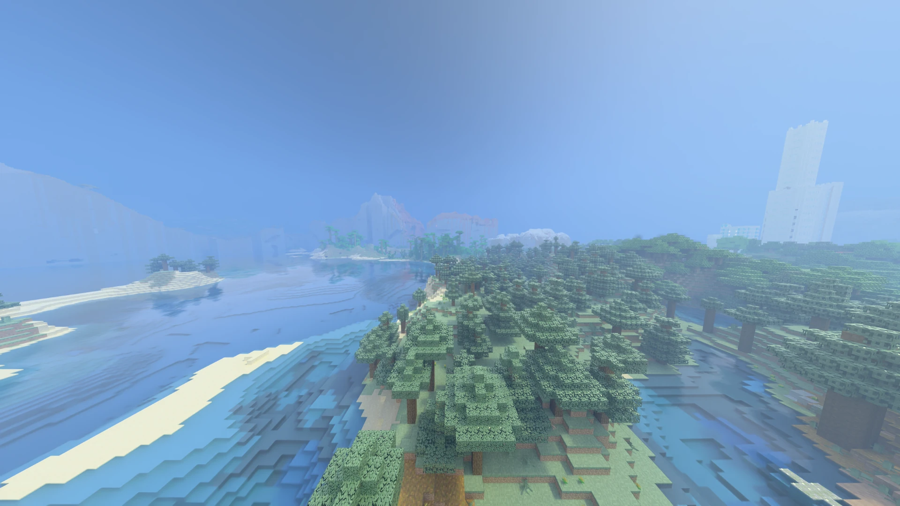
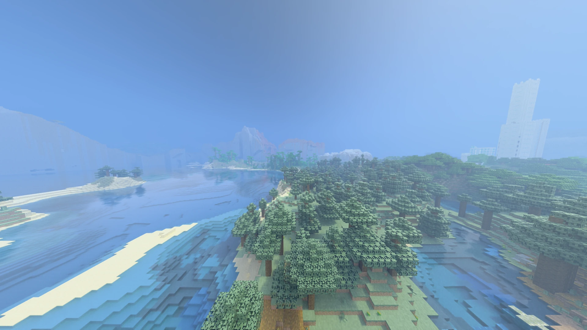
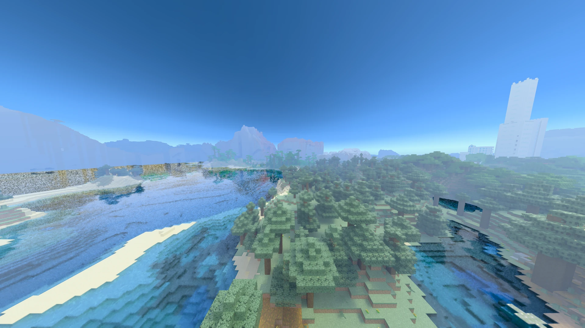

[← Back to index](README.md)

# Upscalers: FSR, DLSS and XeSS

Radiante traces the world at a lower resolution than the screen and an upscaler brings it to the
final resolution. Since 0.5.0 only FSR ships inside the jar; DLSS and XeSS are downloaded from the
game when you want them. The jar is about 15 MB instead of 125 MB, and nobody downloads what their
GPU cannot use.

| | FSR | DLSS | XeSS |
|---|---|---|---|
| In the jar | Yes | No, ~115 MB | No, ~73 MB |
| GPU | Any | NVIDIA only | Windows; Intel Arc recommended, other GPUs depend on their driver |
| System | Windows and Linux | Windows and Linux | Windows only |
| Source | Built in | NVIDIA's repository (DLSS `v310.9.1`) | Intel's repository (XeSS `3.0.2`) |
| Pipeline | RT-NRD-FSR | RT-DLSS (Ray Reconstruction) | RT-NRD-XeSS |
| Frame generation | FSR, 2x | DLSS, up to 4x on RTX 50 | — |

## First start

FSR is the default on every GPU. On first reaching the title screen:

- **NVIDIA:** a window offers DLSS.
- **Intel:** a window offers XeSS (Windows only).
- **AMD:** nothing is offered; FSR is what there is.

The window has three buttons: **Download (N MB)**, **Not now** (asks again next start) and
**Don't ask again**. Progress shows while downloading; **Continue in the background** closes the
window and the download goes on.

## From the settings

In [Quality & Upscaling](settings/quality-and-upscaling.md), the **Pipeline** selector lists the
upscalers your GPU can use even when they are not installed:

- `RT-DLSS (Install)`: can be downloaded.
- `RT-DLSS (Restart required)`: downloaded, loads after a restart.

Picking one of those turns the bottom bar into **Install DLSS (115 MB)**, **Restart to use DLSS**
or **Delete DLSS**, as fits. Installing and deleting are done **outside a world**: in a world the
button asks you to leave first. Upscalers are loaded when the game starts, so installing or
deleting always ends in a forced restart.

**Upscalers.** The same view with each upscaler. The FSR and no-upscaler pipelines also draw a clearer sky, so judge the textures.

*DLSS Quality*

*DLSS Ultra Performance*

*FSR 3*

*No upscaler*

## After installing DLSS

Installing DLSS makes it available but **does not change your pipeline**. If you were on FSR you
are still on FSR after the restart: pick **RT-DLSS** in the Pipeline selector to use it. The one
exception is a fresh install where DLSS was already downloaded: RT-DLSS is picked on its own.

**Reset to Defaults** picks RT-DLSS when DLSS is loaded and FSR otherwise.

## Where they are stored

In the game's `radiante/` folder (next to `mods/`). Each file is checked against its SHA-256 before
use; one that does not match is discarded. What you declined or deleted is remembered in
`radiante/downloads.properties`, so you are not asked again.

To remove an upscaler: **Delete** in the settings. Files in use are deleted on the next start.

## If the download fails

The window shows `Download failed: <reason>`. Usually it is a firewall, a proxy or no connection.
FSR keeps working meanwhile; retry from the settings. If the reason is not obvious, `latest.log`
has the detail: see [Common problems](problems.md).
