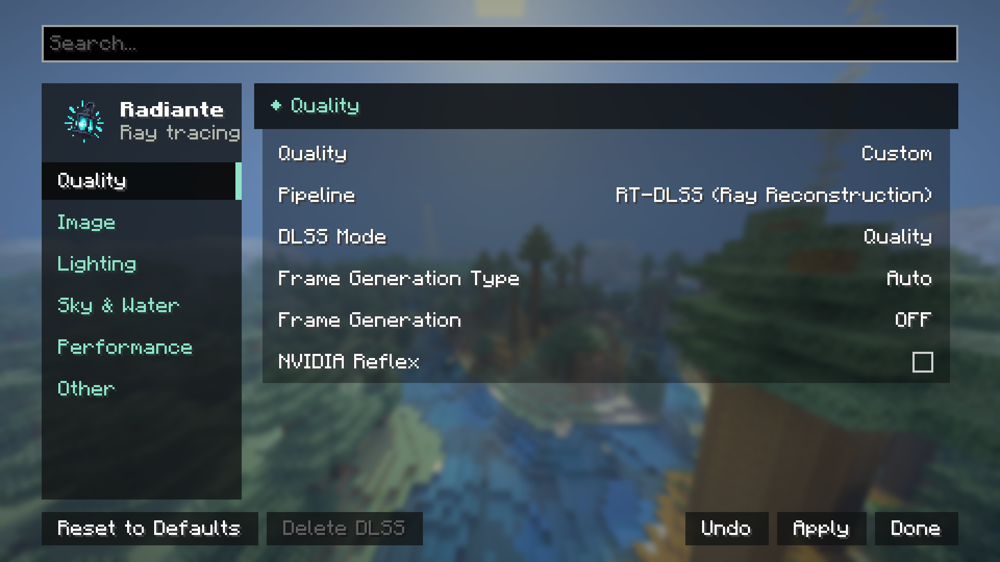

[← Volver al índice](README.md)

# Ajustes de Radiante

Se abren con `F6` dentro de un mundo, o desde el botón de Radiante en Opciones → Ajustes de vídeo
(también en el menú principal). Los cambios se acumulan y se aplican juntos al pulsar "Listo", así
que el renderizador se reconstruye una sola vez. Mientras lo hace se ve la pantalla **Aplicando
ajustes...**, que dura unos segundos.

## Buscar

La caja **Buscar...** filtra los ajustes de todas las categorías por nombre. Es la forma más rápida
de encontrar algo sin saber en qué categoría está.

## Etiquetas de impacto

Los ajustes que más cuestan muestran **Impacto en rendimiento: Bajo / Medio / Alto / Variable** en
su tooltip. Variable significa que depende de la escena (por ejemplo, de cuántas luces haya).

## Calidad y Restablecer valores

**Calidad** (Baja / Media / Alta / Ultra / Personalizado) ajusta de una vez lo que más cuesta:
modo del escalador, rebotes de luz, niebla volumétrica, nubes, distancia de renderizado y más.
Tocar uno de esos a mano lo deja en Personalizado. Detalle en
[estilos-y-calidad.md](estilos-y-calidad.md#niveles-de-calidad).

**Restablecer valores** devuelve todo a un install nuevo, incluidos los ajustes del pipeline y del
shader pack que no tienen control aquí. El pipeline vuelve a RT-DLSS si DLSS está cargado, a FSR si
no.

## Ajustes que piden reiniciar

Algunos (Salida HDR, instalar o borrar un escalador) solo se aplican al reiniciar. Llevan la marca
**(reinicio)** y, al salir de la pantalla, un aviso lista los cambios pendientes con **Cerrar el
juego ahora** o **Más tarde**.

## Categorías

| Sección | Contenido |
|---|---|
| [Calidad y Escalado](opciones/calidad-y-escalado.md) | Pipeline, modo DLSS o de escalado, generación de fotogramas, Reflex. |
| [Imagen](opciones/imagen.md) | Estilo de imagen, mapeo de tonos, exposición, HDR, desenfoque de movimiento, profundidad de campo. |
| [Iluminación](opciones/iluminacion.md) | Brillos, luz rebotada, muestreo de luces de bloque, ReSTIR, SER, luz de objetos. |
| [Cielo, Niebla y Agua](opciones/cielo-niebla-agua.md) | Atmósfera, nubes y sus sombras, niebla y su estilo, lluvia, agua, vidrio. |
| [Rendimiento](opciones/rendimiento.md) | Rebotes de luz, rebotes lejanos, caché, parallax, construcción de chunks. |
| [Otros](opciones/otros.md) | Contorno de bloque, bordes de parallax, registro de depuración. |

Un ajuste solo aparece si el pipeline, la GPU o el shader pack lo admiten: Modo DLSS solo con
RT-DLSS, Reflex solo en NVIDIA, SER solo en RTX 40 o superior. Si algo de esta documentación no
aparece en tu pantalla, depende de eso.

## El botón "Avanzado..."

Desactivado: reservado para una futura pantalla con todos los parámetros del pipeline. Ver
[ROADMAP.md](../../ROADMAP.md#advanced-settings-menu).
