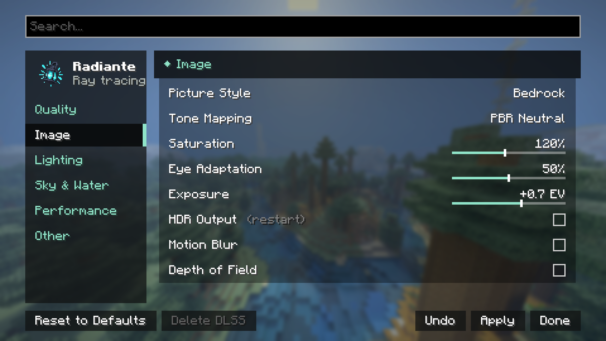

[← Ajustes](../opciones.md) · [Índice](../README.md)

# Imagen

| Control | Rango / Valores | Por defecto | Qué hace |
|---|---|---|---|
| **Estilo de Imagen** | Natural · Bedrock · Vívido · Personalizado | Natural | Ajusta Saturación, Luz Rebotada y Luz del Cielo a la vez. Detalle completo en [estilos-y-calidad.md](../estilos-y-calidad.md#estilos-de-imagen). |
| **Mapeo de Tonos** | PBR Neutral · ACES · Reinhard | PBR Neutral | Cómo se ajusta la luz intensa a lo que la pantalla puede mostrar. PBR Neutral mantiene los colores fieles; ACES es más cinematográfico y con más contraste; Reinhard es suave y plano. |
| **Saturación** | 50% – 200% | 120% | Qué tan colorida es la imagen. 100% no cambia nada respecto al shader pack. |
| **Adaptación del Ojo** | 0% – 100% | 50% | Cuánto se adapta la exposición a lo que miras. Menos mantiene los cuartos oscuros y el día brillante, al estilo Bedrock; 100% siempre iguala la imagen. |
| **Exposición** | -3.0 EV – +3.0 EV | +0.7 EV | Brillo general de la imagen, en pasos fotográficos. |
| **Desenfoque de Movimiento** | Activado/Desactivado | Desactivado | Difumina lo que se mueve en pantalla a lo largo de su movimiento, como una cámara. Cambiarlo recompila los shaders (un breve tirón al aplicar). |
| **Profundidad de Campo** | Activado/Desactivado | Desactivado | Mantiene nítido lo que miras y desenfoca lo mucho más cerca o más lejos, enfocando el centro de la pantalla. También recompila los shaders al cambiarlo. |

## HDR

La sección de HDR está en esta misma categoría, debajo de los controles de arriba. Se explica
entera, con capturas y consideraciones de pantalla, en [hdr.md](../hdr.md) — resumen rápido:

| Control | Rango | Por defecto |
|---|---|---|
| Salida HDR | Activado/Desactivado | Desactivado |
| Brillo Máximo HDR | 400 – 4000 nits | 1000 nits |
| Blanco de Papel HDR | 80 – 400 nits | 200 nits |
| Vista de Depuración HDR | Activado/Desactivado | Desactivado (no se guarda) |

Activar o desactivar la Salida HDR necesita reiniciar el juego; los dos sliders de brillo se aplican
al instante.
